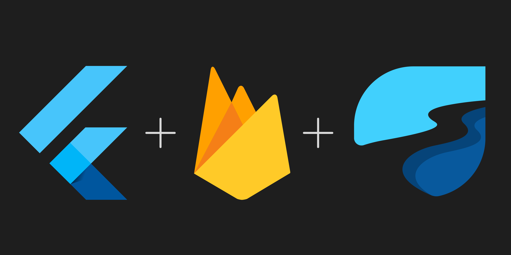

# Instagram Clone
<p align="center">
  <a href="https://firebase.google.com/docs/flutter">
    <br/>
  </a>
  <h1 align="center">Flutter + Firebase + Riverpod</h1>
</p>

A completely Responsive Instagram App- Works only on Android! 

## Features
- Responsive Instagram UI
- Authentication with Google and Facebook
- Share Posts with Caption
- Display Posts with Caption
- Like & Comment on Posts
- Search Posts
- EVERYTHING REAL TIME
- Post Video and Images
- Sign Out


## Installation
After cloning this repository, migrate to ```instagram-clone``` folder. Then, follow the following steps:
- Create Firebase Project
- Enable Authentication
- Make Firestore Rules
- Create Android, iOS & Web Apps
- Take Web FirebaseOptions and put it in main function in main.dart file replacing my keys
Then run the following commands to run your app:
```bash
  flutter pub get
  flutter run
```

## Tech Used
**Server**: Firebase Auth, Firebase Storage, Firebase Firestore, Facebook Developers

**Client**: Flutter, Provider, RiverPod, Hooks
    
## Feedback

If you have any feedback, please reach out to me at amit.singh.9312687983@gmail.com